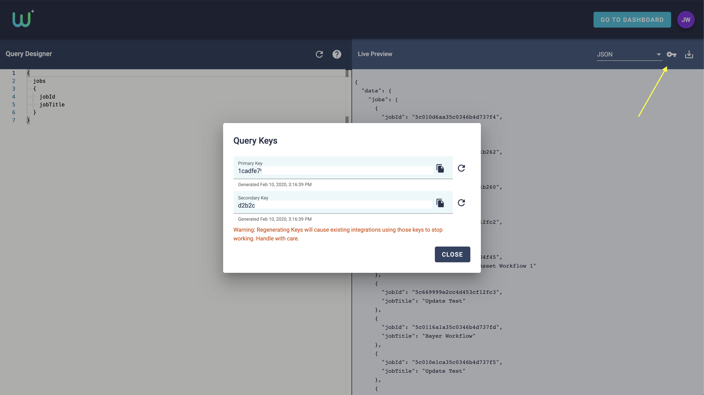
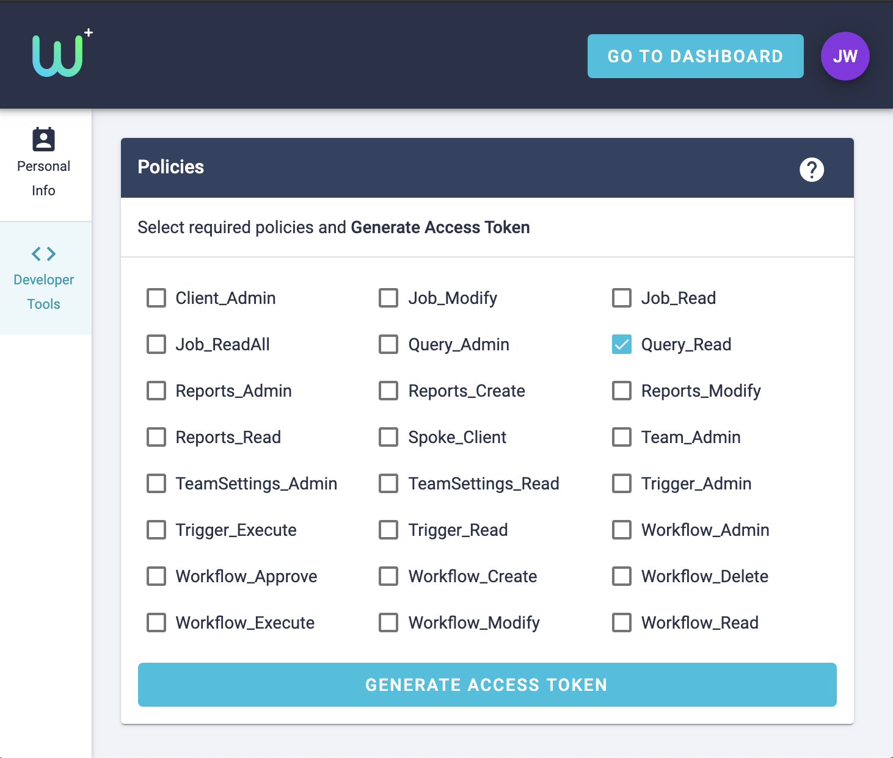

# Accessing {{ site.product_name }} GraphQL API

The {{ site.product_name }} GraphQL endpoints can be accessed in the following ways:

- *Primary/Secondary Key* - A pre-generated set of keys, available within the Query Designer
- *Temporary Key* - A temporary key, sent as part of a HTTP Trigger
- *Access Tokens* - OAuth Access Tokens, available to authorized clients

In all cases, the access granted will allow you to query all completed job data for your team.
See [GraphQL Overview](graphql-overview) for an explanation of the types of queries that can be performed using this service.

---

## Primary/Secondary Keys

2 pre-generated keys are created for each {{ site.product_name }} team.
These keys are available within the [Query Designer](https://dashboard.workfloplus.com/query) through the Keys dialog.
From here you can regenerate the keys, and copy them to your clipboard for convenience.

{{ site.product_name }} primarily employs Oauth2 as the security protocal for APIs however many of the tools that our users wish to use with their WorkfloPlus data can't readily generate the bearer tokens for an Oauth2 API. Therefore the Query API employs access keys; two keys are available per team to use on all calls, these keys can be rotated and generated in line with an internal security protocal.

From a technical standpoint there is no difference between the Primary and Secondary keys and you can use them for your own purposes; typically though the Primary key is used on an ongoing basis and the Secondary key only used only temporarily whilst keys are rotated.

Follow this process to rotate your storage account keys:

1. Update the connection strings in your application(s) query(ies) to use the Secondary key.
2. Regenerate the Primary access key for your queries.
3. Update the connection strings in your application(s) query(ies) to use the new Primary key.
4. Regenerate the Secondary key in the same manner.

**WARNING - If you regenerate a key, any existing links using that key will stop working**


*Primary/Secondary Key Dialog*

### Using Keys

To use a pre-generated key it should be appended to any Query URL using the parameter `key=MyCopiedKey`.

For example:

`{{ site.main_api_base_url }}/api/query/v2/graph?key=MyCopiedKey`

*Note: When you export a query from the Query Designer, the generated URL will contain the Primary Key*

## Temporary Keys

If you have created a HTTP Trigger to receive Job Update/Complete data from WorkfloPlus, the JSON Body will contain a temporary key.
These keys function in the same way as the Primary/Secondary keys, but instead have a 1 hour lifecycle.
Any system that responds to a HTTP Trigger can extract the key from the JSON payload and then use that key to make queries against the GraphQL Endpoint.

As with the Primary/Secondary Keys, the temporary key can be appended to the query string.

*If your implementation requires access beyond 1 hour, consider using Access Tokens.*

#### Example JSON Payload

```json
{
  "data": {
    "jobs": [
      {
        ... Other Job Fields ...
        "key": {
          "value": "AAAAAAAABBBBBBCCCCCCCCCCCC",
          "expiry": "2020-06-11T14:03:07Z"
        }
      }
    ]
  }
}
```

## Access Tokens

Access tokens can be acquired in a number of ways.

- A testing key can be generated using [Developer Tools](https://accounts.workfloplus.com/manage/dev)
- Via a custom API client

To get access to the WorkfloPlus Client API, please [contact Intoware Support](mailto:support@intoware.com).

### Generating Test Keys

From the [WorkfloPlus Developer Tools](https://accounts.workfloplus.com/manage/dev) you can create a temporary access token with the **Query Read** permission.
This will return an `access_token` and `id_token` that can be used in the Headers of a GraphQL request.

```
GET - {{ site.main_api_base_url }}/api/query/v2/graph?query=%7B%20jobs%20%7B%20jobId%20jobTitle%20%7D%20%7D

HEADERS:
Authorization : Bearer [PASTE ACCESS TOKEN HERE]
```

The testing Access Tokens comes with a 1hr lifetime and will return a `401 Unauthorized` error when expired.
If you supply an Access Token with the wrong scope then the API wiill return `403 Forbidden`.


*Primary/Secondary Key Dialog*