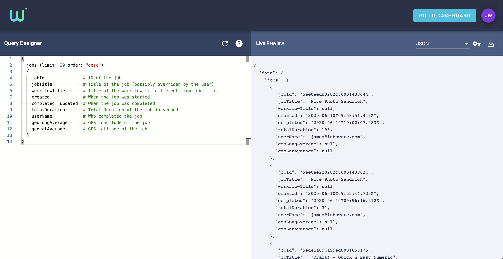
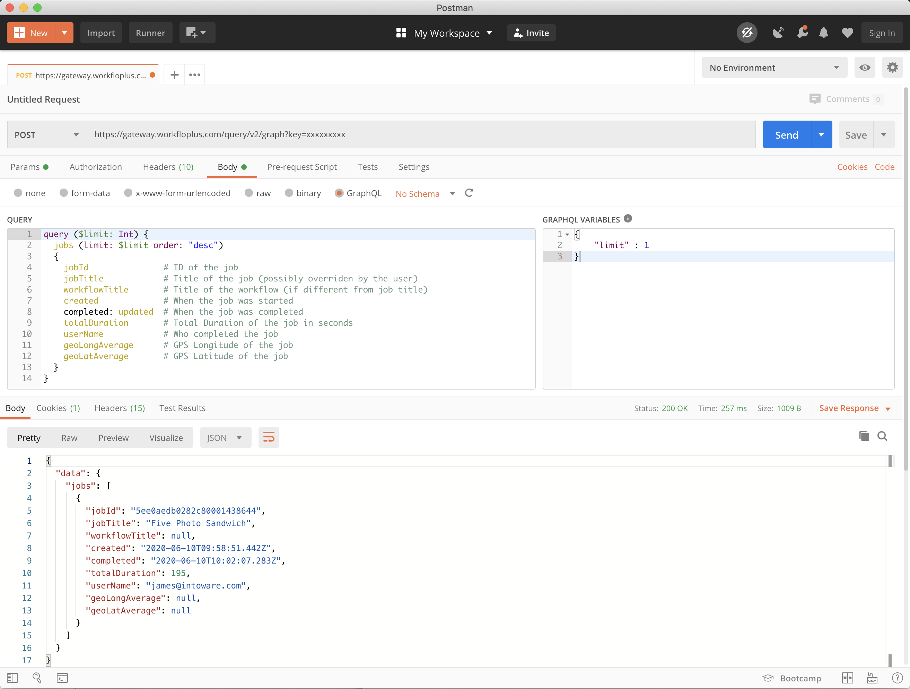

# GraphQL Overview
{: .no_toc }

## Table of contents
{: .no_toc .text-delta }

1. TOC
{:toc}

---

WorkfloPlus surfaces all of it's data through GraphQL, a technology originally developed within Facebook. GraphQL provides an API Surface for clients to query and a Runtime to execute those queries.

GraphQL is used instead of making traditional HTTP GET requests to grant API clients access to the underlying data. With this new technology, the client will construct a GraphQL query to be executed by the runtime. The fields requested will reflect the data returned.

## Advantages compared to GET Requests

**Concise Queries**

With a traditional REST API, the GET endpoints usually return all of the fields to satisfy all commands. This can be costly and usually returns data that the client doesn't need. With GraphQL, the clients (mobile app, web page, background processor) can specify only the fields that they need.

**Database Abstraction**

The clients do not need to understand the internal database schema or how the data is assembled. The GraphQL schema will define the data that can be queried without concerning the client as to how that data is constructed.

**Accessibility**

GraphQL queries are executed using standard HTTP GET or HTTP POST requests. A query can either be added to the end of a GET request, or, serialized into JSON and supplied in the body of a HTTP POST request.

**Schema Additions**

GraphQL Vendors (ie: WorkfloPlus) can easily amend the schemas by adding extra fields. This will not increase the amount of data returned by existing clients, unless those clients choose to add those fields.

**Data Relationships**

Similar to SQL, GraphQL data can be related to other data. For example, in WorkfloPlus you can:

- Get a list of users and the groups they belong to
- Get a list of groups and the users they contain

This is querying for the same data, but is instead being accessed from either direction.

### More Information

There is a huge wealth of information on GraphQL and its features at [graphql.org](https://www.graphql.org){:target="_blank"}.

---

## Trying out GraphQL

Within WorkfloPlus, GraphQL is designed to be embedded into data clients (ie: software designed to extract data from WorkfloPlus). But, in order to test out the queries, there are a number of tools that can be supported.

### WorkfloPlus Query Designer
{: .d-inline-block }

Preferred
{: .label .label }

Available within the [WorkfloPlus Dashboard](https://dashboard.workfloplus.com/query){:target="_blank"} (WorkfloPlus account required), the Query Designer can be used to test your GraphQL queries against the data in your WorkfloPlus Team. Once you have tested out your query then you can export a GET or POST URL to import into your own system.

For more information on the query designer, see [here](query-designer).


*WorkfloPlus Query Designer*

### Postman

The excellent [Postman Tool](https://www.getpostman.com){:target="_blank"} has built-in support for making GraphQL queries. To access the WorkfloPlus GraphQL endpoint, you'll need to fetch an [access key](getting-access) in order to get access to the data.

Unlike the WorkfloPlus Query Designer, Postman supports GraphQL variables. This will allow you to design your queries for reuse so you can separate your template and variables. WorkfloPlus supports the full GraphQL specification for variables.

*See the [GraphQL specification on variables](https://graphql.org/learn/queries/#variables){:target="_blank"} for more information*


*Postman WorkfloPlus GraphQL Example*

### GET / POST Requests

If you'd like to build this functionality into your application, you can access the data via the direct HTTP GET or POST endpoints.

`https://gateway.workfloplus.com/api/query/v2/graph`

*Note, you will need to authenticate this request using one of the supported [access key formats](getting-access)*

For a more detailed explanation, see [GraphQL.org - Serving over HTTP](https://graphql.org/learn/serving-over-http/){:target="_blank"}.

**GET Request**

For a GET Request, simply take your GraphQL query and append it to the query endpoint as a URL-encoded string.

For example:

```graphql
{
    jobs {
        jobId
        jobTitle
    }
}
```

becomes

`https://gateway.workfloplus.com/api/query/v2/graph?query=%7B%20jobs%20%7B%20jobId%20jobTitle%20%7D%20%7D`

**POST Request**

For a POST Request, the same query endpoint is used, but the query should be encoded within a JSON payload.

```json
{
  "query": "{\njobs\n{\njobId\njobTitle\n}\n}"
}
```