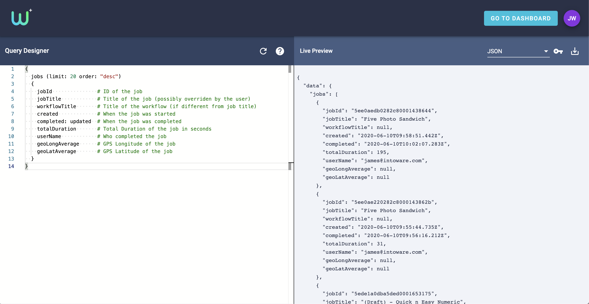
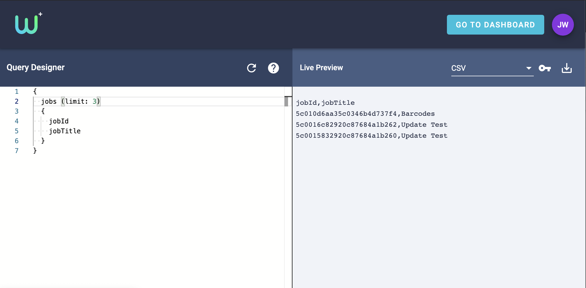

# Query Designer
{: .no_toc }

## Table of contents
{: .no_toc .text-delta }

1. TOC
{:toc}

---

The WorkfloPlus Query Designer is a developer tool to help design GraphQL queries against your WorkfloPlus Team data.

You can access the query designer by selecting *Query* from the WorkfloPlus Dashboard menu.

*WorkfloPlus Query Designer*

## Writing Queries

The Query Designer includes a [Monaco Editor](https://microsoft.github.io/monaco-editor/){:target="_blank"} which provides basic syntax highlighting, auto-completion and other code editor features.

When you start typing your query, the text is automatically previewed and (if valid), a result will be returned in the preview window.

*Any syntax errors will be displayed in the results.*

See [Example Queries](examples) for different use-cases.

## Exporting Queries

When you are happy with your query, you can export the query to either:

- **HTTP GET** - A complete URL to paste directly into your browser
- **HTTP POST** - A URL and Body to be used in your code

The query will be exported either as JSON or CSV, depending on your preference in the Query Designer.

By default, the query will contain the Primary key, but you are free to change this to any on of the [supported access mechanisms](getting-access).

*Query Designer Export*

## CSV Queries

By default, GraphQL renders any results to the JSON format. But, the WorkfloPlus Query API can also render results to CSV.

Limitations:

- All errors are suppressed, only the `data` field is exported
- All arrays are flattened with a 0-based index in the column
- Each top-level item is converted into a CSV-row
    - Each sub-level item is flattened into a column

*If your resulting data doesn't look right, switch back to JSON and check for any errors*

It is not advised to produce a query that contains too many columns, or the resulting data may be too much for your integration.

To try out CSV, simply change the format toggle from JSON to CSV. You will see the results appear immediately.

To programmatically return CSV data from the GraphQL endpoints, append `&csv=true` to the query string.
This works for both HTTP GET and HTTP POST requests.

*Note: When queried in HTTP, the returned `Content-Type` will be `text/csv`.*

*Query Designer CSV Output*